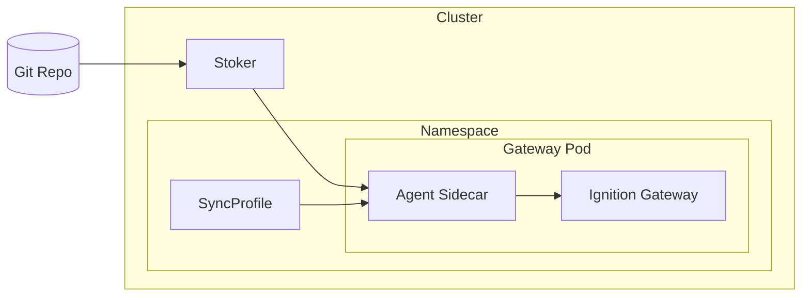

<p align="center">
  
</p>

# Stoker

<p align="center">
  <a href="https://github.com/ia-eknorr/stoker-operator/actions/workflows/lint.yml"></a>
  <a href="https://github.com/ia-eknorr/stoker-operator/actions/workflows/test.yml"></a>
  <a href="https://github.com/ia-eknorr/stoker-operator/releases/latest"></a>
  <a href="https://github.com/ia-eknorr/stoker-operator/blob/main/LICENSE"></a>
  <a href="https://ia-eknorr.github.io/stoker-operator/"></a>
  <a href="https://goreportcard.com/report/github.com/ia-eknorr/stoker-operator"></a>
</p>

> **stok·er** /ˈstōkər/ — *a person who tends the fire in a furnace, feeding it fuel to keep it burning.*

Stoker tends your Ignition gateways, continuously feeding them configuration from Git to keep them running in the desired state.

## Features

- **Git-driven configuration sync** — gateway projects, tags, and resources managed in Git
- **Multi-gateway support** — manage any number of gateways from a single repository with template variables
- **SyncProfile mappings** — declarative source-to-destination file mappings with glob patterns and template variables
- **Automatic sidecar injection** — MutatingWebhook injects the sync agent into annotated pods
- **Gateway discovery** — controller discovers annotated pods and aggregates sync status
- **Webhook receiver** — push-event-driven sync via `POST /webhook/{namespace}/{crName}`
- **Deployment mode overlays** — per-profile overlays applied after mappings

## Quick Start

```bash
# Install cert-manager (required for webhook TLS)
kubectl apply -f https://github.com/cert-manager/cert-manager/releases/download/v1.17.2/cert-manager.yaml

# Install the operator
helm install stoker oci://ghcr.io/ia-eknorr/charts/stoker-operator \
  -n stoker-system --create-namespace
```

For a complete walkthrough — from installing the operator to syncing projects to an Ignition gateway — see the **[Quickstart Guide](https://ia-eknorr.github.io/stoker-operator/quickstart)**.

## Architecture



## CRDs

| CRD | Description |
| --- | --- |
| [`Stoker`](https://ia-eknorr.github.io/stoker-operator/configuration/stoker-cr) | Defines the git repository, auth, polling, and gateway connection settings |
| [`SyncProfile`](https://ia-eknorr.github.io/stoker-operator/configuration/sync-profile) | Defines file mappings, deployment mode overlays, exclude patterns, and template variables |

## Development

See [CONTRIBUTING.md](CONTRIBUTING.md) for build commands, testing, and development workflow.

## License

This project is licensed under the [MIT License](LICENSE).
